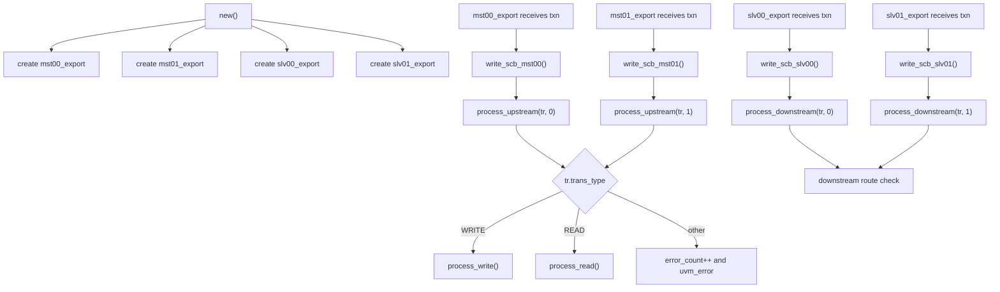
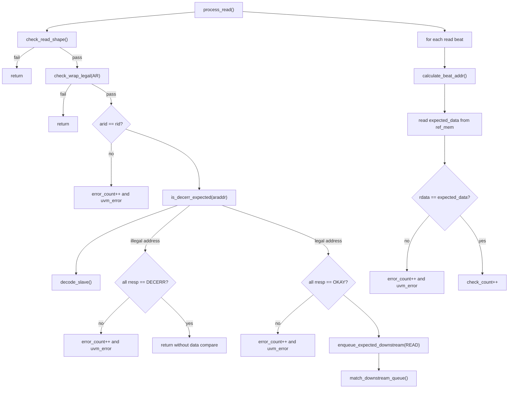
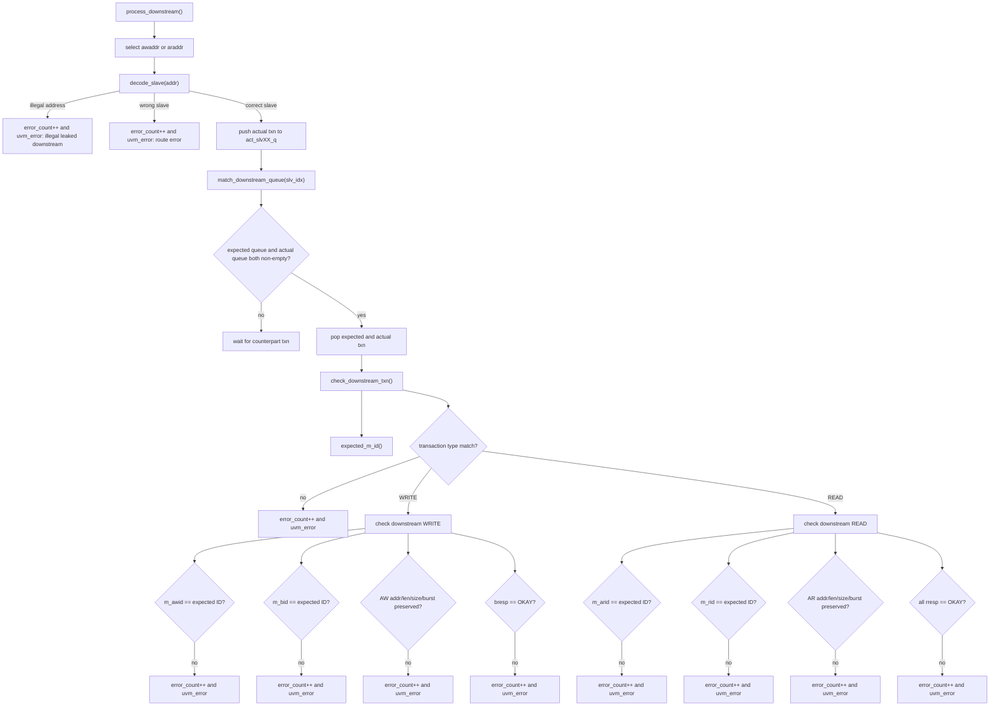
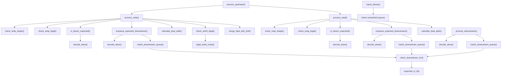
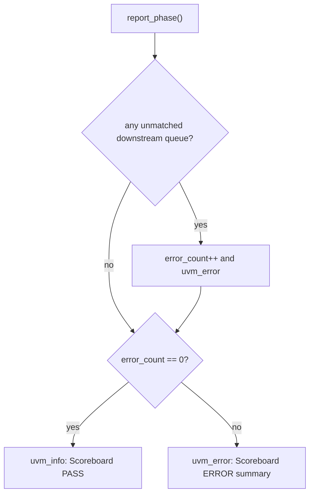

# AXI Crossbar Scoreboard Flow

本文档描述 `uvm/env/axicb_scoreboard.sv` 的当前设计架构。  
当前 scoreboard 中没有 `task`，所有行为都通过 `function` 实现。

## 1. Scoreboard 总体职责

`axicb_scoreboard` 同时接收 upstream master 侧 monitor transaction 和 downstream slave 侧 monitor transaction。

它主要完成三类检查：

1. upstream 响应检查：确认 master 侧看到的 `BRESP/RRESP/ID/read data` 符合预期。
2. reference memory 检查：write 更新 `ref_mem`，read 从 `ref_mem` 比对返回数据。
3. downstream 路由检查：确认 crossbar 输出到正确 slave，并保持关键 AXI 属性不变。

## 2. 顶层入口流程

## 3. Upstream WRITE 检查流程

`process_write()` 是 upstream write transaction 的主检查入口。  
它先检查 transaction 形态，再检查响应，然后生成 downstream 期望事务，最后更新 `ref_mem`。

```mermaid
flowchart TD
    PW["process_write()"] --> SHAPE["check_write_shape()"]
    SHAPE -->|fail| RET0["return"]
    SHAPE -->|pass| WRAP["check_wrap_legal(AW)"]
    WRAP -->|fail| RET1["return"]
    WRAP -->|pass| IDCHK{"awid == bid?"}

    IDCHK -->|no| EID["error_count++ and uvm_error"]
    IDCHK --> ADDRCHK["is_decerr_expected(awaddr)"]
    ADDRCHK --> DECODE1["decode_slave()"]

    ADDRCHK -->|illegal address| BDEC{"bresp == DECERR?"}
    BDEC -->|no| EBDEC["error_count++ and uvm_error"]
    BDEC -->|yes| RET2["return without ref_mem update"]

    ADDRCHK -->|legal address| BOK{"bresp == OKAY?"}
    BOK -->|no| EBOK["error_count++ and uvm_error"]
    BOK --> ENQW["enqueue_expected_downstream(WRITE)"]

    ENQW --> MATCH0["match_downstream_queue()"]

    PW --> LOOPW["for each write beat"]
    LOOPW --> ADDRW["calculate_beat_addr()"]
    ADDRW --> WSTRB["check_wstrb_legal()"]
    WSTRB --> MASK["legal_wstrb_mask()"]
    WSTRB -->|invalid lane| EWSTRB["error_count++ and uvm_error"]
    LOOPW --> MERGE["merge_data_with_strb()"]
    MERGE --> REFMEMW["update ref_mem[word_addr]"]
```

### WRITE 相关 function 说明

| Function | 作用 |
| --- | --- |
| `process_write()` | WRITE 主流程，检查 upstream write 响应，并更新 reference memory。 |
| `check_write_shape()` | 检查 `wdata/wstrb/current_wbeat_count` 是否和 `AWLEN + 1` 一致。 |
| `check_wrap_legal()` | 当 `AWBURST == WRAP` 时检查 WRAP len 合法性和起始地址对齐。 |
| `is_decerr_expected()` | 判断当前写地址是否应该返回 DECERR。 |
| `decode_slave()` | 根据地址判断目标 slave，非法地址返回 `-1`。 |
| `enqueue_expected_downstream()` | 对 legal write 生成 downstream 期望事务。 |
| `match_downstream_queue()` | 尝试将期望 downstream 事务和实际 downstream 事务做 FIFO 匹配。 |
| `calculate_beat_addr()` | 根据 `FIXED/INCR/WRAP` 计算每个 beat 的有效地址。 |
| `check_wstrb_legal()` | 检查当前 beat 的 `WSTRB` 是否只打开合法 byte lane。 |
| `legal_wstrb_mask()` | 根据 beat 地址和 `AWSIZE` 生成合法 byte lane mask。 |
| `merge_data_with_strb()` | 根据 `WSTRB` 把 write data 合并进 `ref_mem`。 |

## 4. Upstream READ 检查流程

`process_read()` 是 upstream read transaction 的主检查入口。  
它先检查 read transaction 形态，再检查响应，然后生成 downstream 期望事务，最后从 `ref_mem` 比对 readback data。

### READ 相关 function 说明

| Function | 作用 |
| --- | --- |
| `process_read()` | READ 主流程，检查 upstream read 响应和 readback data。 |
| `check_read_shape()` | 检查 `rdata/rresp/current_rbeat_count` 是否和 `ARLEN + 1` 一致。 |
| `check_wrap_legal()` | 当 `ARBURST == WRAP` 时检查 WRAP len 合法性和起始地址对齐。 |
| `is_decerr_expected()` | 判断当前读地址是否应该返回 DECERR。 |
| `decode_slave()` | 根据地址判断目标 slave，非法地址返回 `-1`。 |
| `enqueue_expected_downstream()` | 对 legal read 生成 downstream 期望事务。 |
| `match_downstream_queue()` | 尝试将期望 downstream 事务和实际 downstream 事务做 FIFO 匹配。 |
| `calculate_beat_addr()` | 根据 `FIXED/INCR/WRAP` 计算每个 beat 的有效地址。 |

## 5. Downstream 路由和属性检查流程

`process_downstream()` 接收 slave 侧 monitor 看到的实际 downstream transaction。  
它先确认 transaction 没有泄漏到非法地址，也没有路由到错误 slave，然后进入 FIFO 匹配。

### Downstream 相关 function 说明

| Function | 作用 |
| --- | --- |
| `process_downstream()` | 处理 slave 侧实际 transaction，检查路由地址和目标 slave 是否正确。 |
| `decode_slave()` | 用 downstream transaction 地址反推出它应该到达哪个 slave。 |
| `match_downstream_queue()` | 对同一个 slave 的 expected queue 和 actual queue 做 FIFO 匹配。 |
| `check_downstream_txn()` | 检查 downstream 事务是否保持预期的 type、ID、addr、len、size、burst 和 response。 |
| `expected_m_id()` | 根据 upstream master index 和原始 ID 计算 downstream master-side ID。 |

## 6. Helper 调用关系

## 7. 收尾检查流程

`report_phase()` 在仿真结束时执行最终检查。

## 8. 全部 function 清单

| Function | 类型 | 主要职责 |
| --- | --- | --- |
| `new()` | constructor | 创建 4 个 analysis export。 |
| `write_scb_mst00()` | analysis callback | 接收 master0 upstream transaction，并调用 `process_upstream(tr, 0)`。 |
| `write_scb_mst01()` | analysis callback | 接收 master1 upstream transaction，并调用 `process_upstream(tr, 1)`。 |
| `write_scb_slv00()` | analysis callback | 接收 slave0 downstream transaction，并调用 `process_downstream(tr, 0)`。 |
| `write_scb_slv01()` | analysis callback | 接收 slave1 downstream transaction，并调用 `process_downstream(tr, 1)`。 |
| `process_upstream()` | local function | 根据 transaction 类型分发到 write/read 检查流程。 |
| `process_downstream()` | local function | 检查 downstream 地址和 slave 路由，并保存实际 downstream transaction。 |
| `process_write()` | local function | 检查 upstream write 响应，生成 downstream 期望事务，更新 `ref_mem`。 |
| `process_read()` | local function | 检查 upstream read 响应，生成 downstream 期望事务，比对 `ref_mem` 数据。 |
| `enqueue_expected_downstream()` | local function | 将 legal upstream transaction 转换为 expected downstream transaction。 |
| `match_downstream_queue()` | local function | 将 expected downstream queue 和 actual downstream queue 做 FIFO 匹配。 |
| `check_downstream_txn()` | local function | 检查 downstream transaction 的 type、ID、地址属性和 response。 |
| `check_write_shape()` | local function | 检查 write beat 数组大小和 beat count。 |
| `check_read_shape()` | local function | 检查 read beat 数组大小和 beat count。 |
| `check_wrap_legal()` | local function | 检查 WRAP burst 的 len 和起始地址对齐。 |
| `check_wstrb_legal()` | local function | 检查 WSTRB 是否只覆盖当前 transfer 合法 byte lane。 |
| `legal_wstrb_mask()` | local function | 生成当前地址和 size 对应的合法 WSTRB mask。 |
| `calculate_beat_addr()` | local function | 计算 FIXED、INCR、WRAP burst 每个 beat 的有效地址。 |
| `merge_data_with_strb()` | local function | 根据 WSTRB 合并 write data 到 reference word。 |
| `expected_m_id()` | local function | 计算 downstream 侧应观察到的 master ID。 |
| `decode_slave()` | local function | 将地址 decode 到 slave0、slave1 或非法地址。 |
| `is_decerr_expected()` | local function | 判断地址是否应该触发 DECERR。 |
| `report_phase()` | phase function | 检查未匹配 downstream transaction，并输出 scoreboard 总结。 |

## 9. 当前实现边界

当前 scoreboard 的 downstream 匹配采用每个 slave 一条 FIFO queue。  
这适合 P3 基础 directed burst testcase，例如 FIXED、INCR、WRAP、burst length、burst size、WSTRB 和 readback 检查。

如果后续加入更复杂的多 outstanding、跨 ID 乱序返回、interleave 等场景，`match_downstream_queue()` 和 `check_downstream_txn()` 可以在这个基础上扩展为 ID-aware 或 order-aware 的匹配方式。
